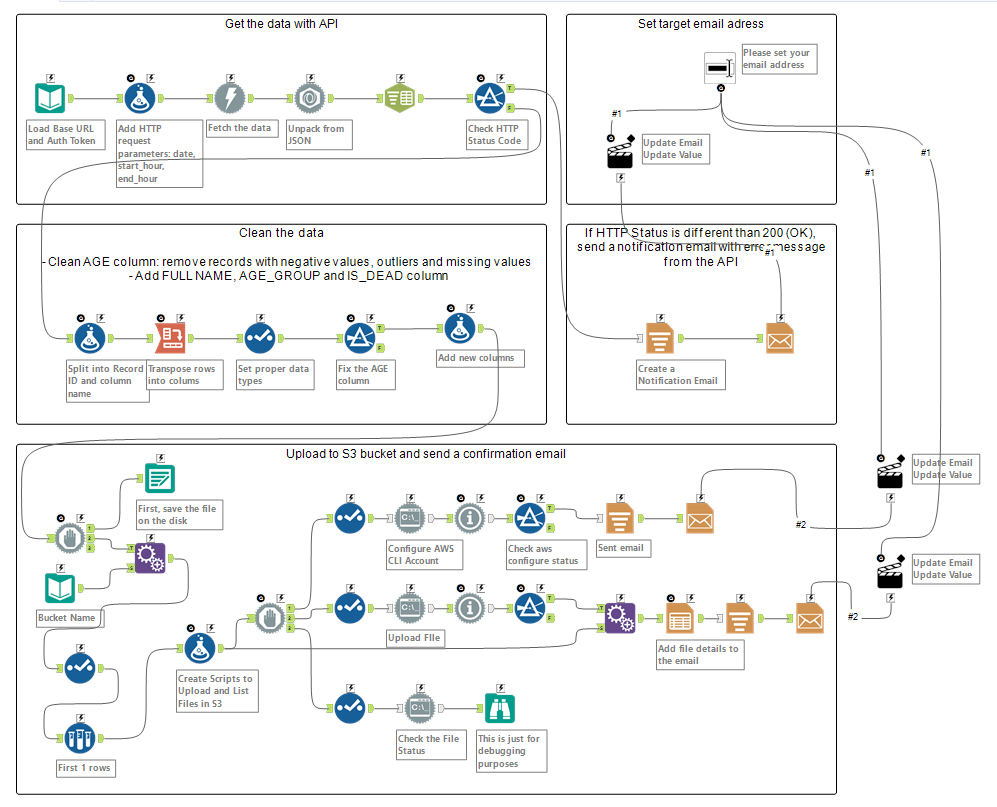
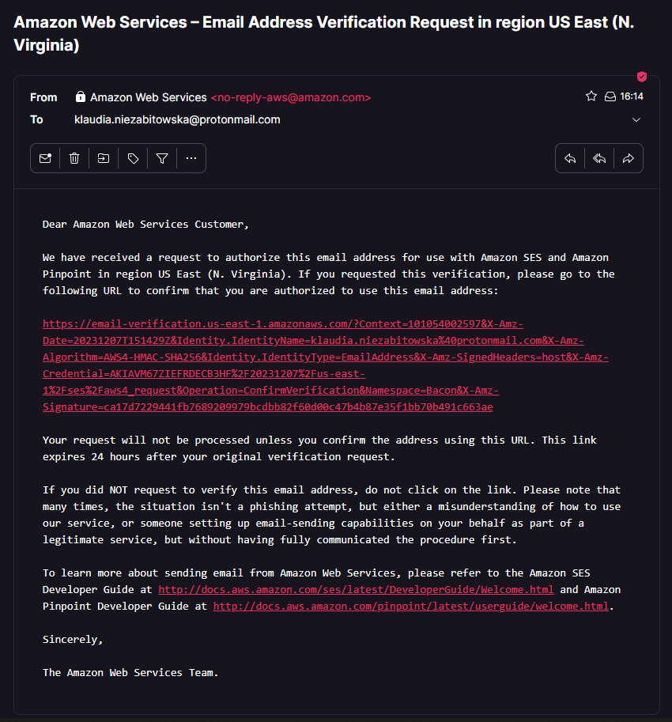
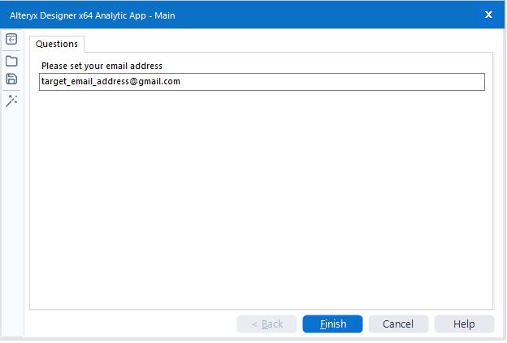
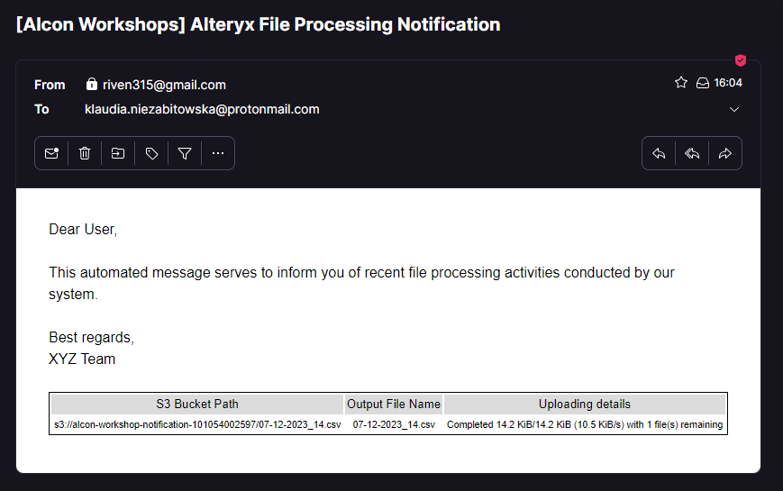
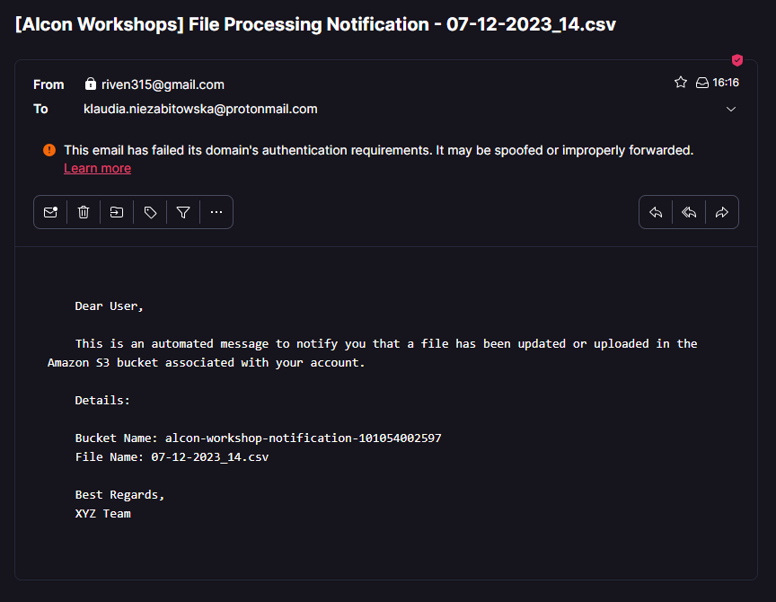
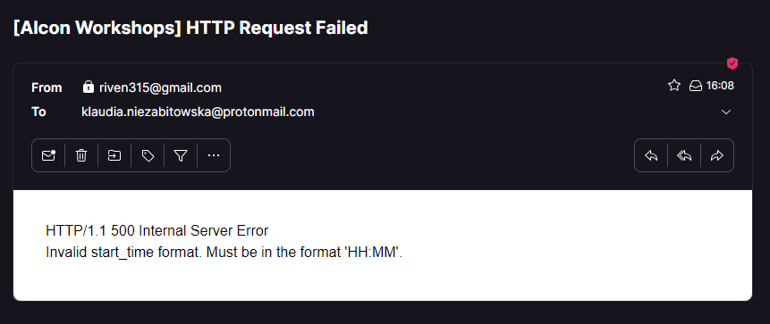
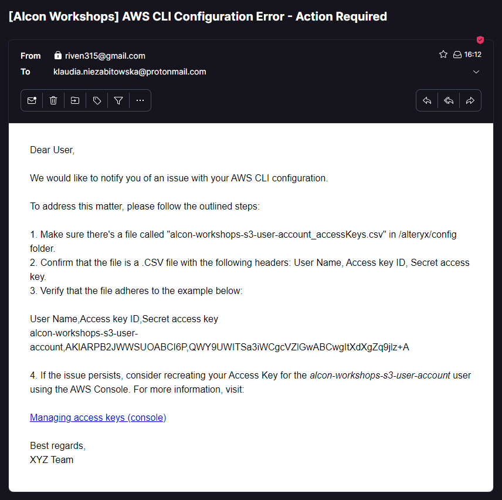

# AWS Alteryx Alcon Workshops 2023

## Objectives 

Objective 1
* Extract data from a provided API with Alteryx, transform it from JSON to a conventional format, clean the data and load csv file into an AWS S3 bucket. Incorporate an email notification for successful data loading into your Alteryx workflow. 
* Explore adding error handling to the workflow and sending a different email notification in case of a failure.

Objective 2
* Add an email notification with Lambda once new file will appear or existing will be updated in the AWS S3 bucket.

## Alteryx Workflow 



  File with the workflow: <a href="./alteryx/Main.yxwz">./alteryx/Main.yxwz</a>

  AWS CLI scripts in Alteryx:
  - import AWS configuration settings from a CSV file
  ```
  'aws configure import --csv "file://' + Replace([Engine.WorkflowDirectory], '\', '/') + '/config/alcon-workshops-s3-user-account_accessKeys.csv" --profile aws_workshops_profile > ./logs/config_log.txt 2>&1 || exit 0'
  ```

  - copy a file from a local directory to an Amazon S3 bucket
  ```
  "aws s3 cp ./outputs/" + [output_file_name] + " " + [s3_file_path] + " --profile alcon-workshops-s3-user-account > ./logs/upload_log.txt 2>&1 || exit 0"
  ```

  - retrieve metadata for an object in an Amazon S3 bucket without downloading the object (optional)
  ```
  "aws s3api head-object --bucket " + [s3_bucket_name] + " --key " + [output_file_name] + " --profile alcon-workshops-s3-user-account > ./logs/control_log.txt 2>&1 || exit 0"
  ```

## Lambda Trigger

Please check out following modules and files:

- terraform-aws-lambda module: <a href="./modules/terraform-aws-lambda/">./modules/terraform-aws-lambda/</a>

    The script configures the IAM role with specific policies to grant necessary permissions for Lambda function execution, such as accessing Amazon S3 buckets, writing to CloudWatch Logs, and sending emails using Amazon Simple Email Service (SES).

- Lambda source file: <a href="./src/lambda_s3_trigger.py/">./src/lambda_s3_trigger.py/</a> 

    This Python script serves as an AWS Lambda function designed to respond to Amazon S3 bucket events. When triggered by a file update or upload event, the function sends an email notification using Amazon Simple Email Service (SES) to a specified recipient. 

- main file to create the module: <a href="./main.tf">./main.tf</a> 

    This Terraform script defines infrastructure as code to set up AWS resources, focusing on an S3 bucket and a Lambda function for a notification system. 


## Usage (on Windows):

  ### 1. Configure sender and receiver email addresses by modifying the terraform.tfvars file.
  ```
    sender_email_address="sender_email_address@gmail.com"
    recipient_email_address="recipient_email_address@gmail.com" 
  ```


The project comes with Amazon SES (Simple Email Service) Sandbox as the default setting. To get things up and running smoothly, both emails need to be verified first. Once you've set up the resources using Terraform, check your inbox for a verification email sent to BOTH specified email addresses (check out step 3).

  ### 2. Execute the following command in the project folder's parent directory:

  ```
    powershell.exe -ExecutionPolicy Unrestricted -File .\build_infrastructure.ps1
  ```

  This will:

  * Create an S3 Bucket along with its corresponding IAM User.
  * Generate Access Key and Secret for the Alteryx workflow and store them in the alteryx/config folder, enabling it to execute AWS CLI commands.
  * Create Lambda Function and Trigger Permissions and associated roles and policies.
  * Create SES Identities.

 ### 3. Complete email address verification requests from Amazon (both accounts)



### 4. Launch the Alteryx Workflow/Analytic App and enter the designated email address where you will receive a notification upon successful execution.



## Sample email messages

### Email Notification for Successful Upload



### Lambda Trigger-Initiated Email



### Failed HTTP Request Notification



### Email Alert for AWS Credential Issues




## References 
https://docs.aws.amazon.com/lambda/latest/dg/with-s3-example.html

https://medium.com/@vijai.nallagatla/aws-ses-smtp-service-terraform-infra-aeac9a62917d

https://github.com/zdoryk/alcon-de-aws-workshop-students